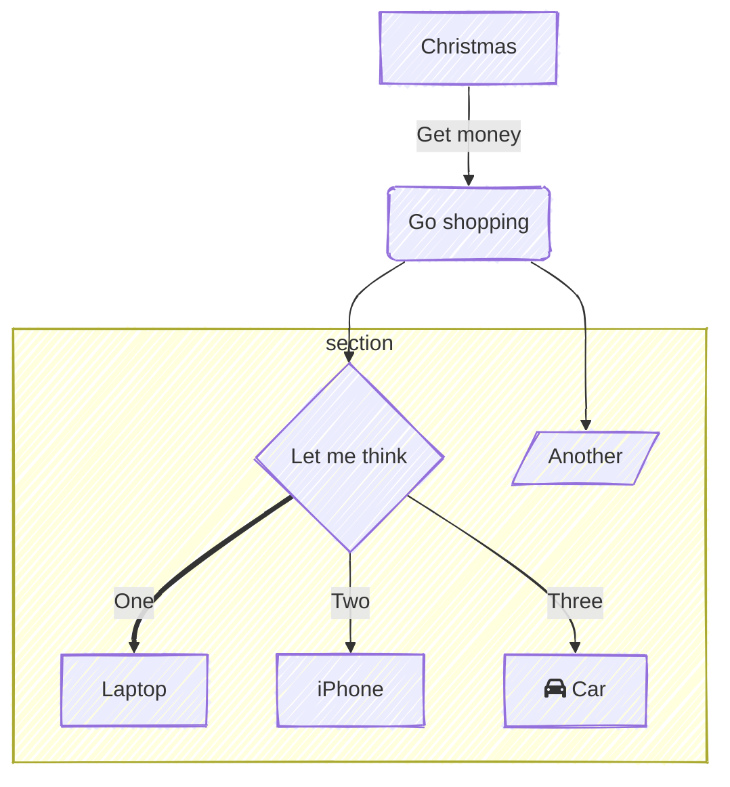

# Mermaid

https://mermaid.ai/open-source/config/theming.html

https://mermaid.ai/docs/blog/posts/mermaid-innovation-introducing-new-looks-for-mermaid-diagrams

## Types

### sequenceDiagram

### flowchart

## Themes

### Unspecified

### neutral

### dark

### base

### forest

### default

### neo-dark

### neo

### mc

### Customized theme

### Dark mode TRUE

### Dark mode FALSE

## Look

### classic

### neo

### handDrawn

